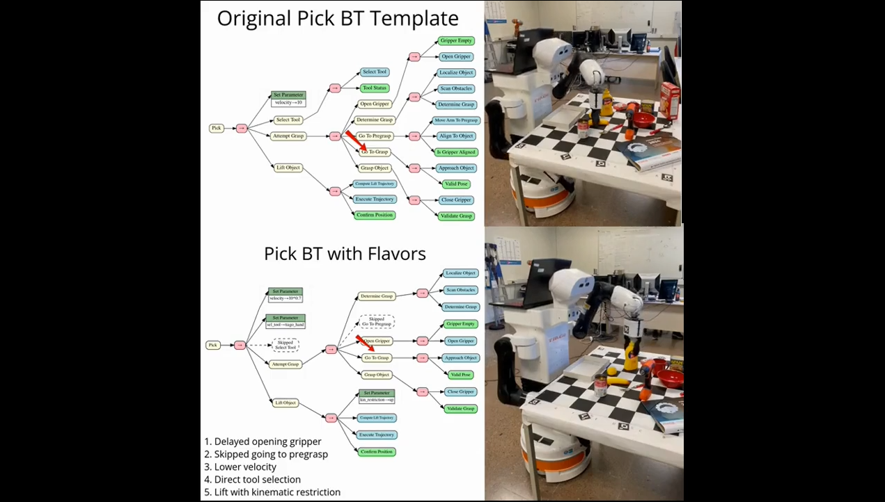

# Knowledge-based Execution Configuration for Adaptive Behavior Trees


## Description

This repository contains the knowledge files supporting the implementation and evaluation of the methods presented in the paper "Knowledge-based Execution Configuration for Adaptive Behavior Trees.", part of the BeAware framework.

The included resources provide essential components to understand and extend the example scenario discussed in the paper, including:

- Behavior Trees (BTs): Templates defining the structure and flow for the example scenario’s adaptive behaviors.

- Ontologies:
    - `beaware_ontology.owl`: The base ontology to use in the BeAware Framework.

    - `application_ontology_example.owl`: An instantiated ontology tailored for the specific example scenario.

- PDDL: A Planning Domain Definition Language (PDDL) domain file that formalizes the planning aspects of the example scenario.


## Example video

The following video illustrates the execution of two Pick Behaviors, one being the Base Template without Flavors, the other with 5 example Flavors applied. 
[](videos/video.mp4)


---

## Citation

If you use this work, please cite the paper:

```
@Article{Ruiz-Celada2026,
author={Ruiz-Celada, Oriol
and Rosell, Jan
and Su{\'a}rez, Ra{\'u}l},
title={Knowledge-based Execution Configuration for Adaptive Behavior Trees},
journal={Journal of Intelligent {\&} Robotic Systems},
year={2026},
month={Mar},
day={06},
abstract={Automated planning is commonly used to obtain plans to solve particular tasks. To execute these plans, Behavior Trees have emerged as a popular execution architecture due to their reactivity and modularity. Configuring the execution of a plan into a Behavior Tree requires expanding the high level actions into the proper Behavior Tree structure. Typically, this is achieved using of pre-defined rigid templates. In this work, we propose a novel approach to generating the Behavior Trees using ontologies. The generated Behavior Trees are tailored to the specific requirements of a task and the world by using modifiers to a base template that provides a general solution to the task. These modifiers and their properties are formally defined using ontologies. A proof of concept is developed, illustrating how the Behavior Trees for the execution of manipulation tasks in a kitchen scenario can be adapted to varying conditions by applying different modifiers.},
issn={1573-0409},
doi={10.1007/s10846-026-02373-1},
url={https://doi.org/10.1007/s10846-026-02373-1}
}

```
---


## Authors

- **Oriol Ruiz-Celada**  (Corresponding Author)
  Institute of Industrial and Control Engineering  
  Universitat Politècnica de Catalunya, Barcelona, Spain  
  Email: oriol.ruiz.celada@upc.edu  


- **Jan Rosell**  
  Institute of Industrial and Control Engineering  
  Universitat Politècnica de Catalunya, Barcelona, Spain  
  Email: jan.rosell@upc.edu  


- **Raúl Suárez**  
  Institute of Industrial and Control Engineering  
  Universitat Politècnica de Catalunya, Barcelona, Spain  
  Email: raul.suarez@upc.edu  


### Correspondence

For any inquiries regarding this repository or the associated paper, please contact the corresponding author: **Oriol Ruiz-Celada** at [oriol.ruiz.celada@upc.edu](mailto:oriol.ruiz.celada@upc.edu).